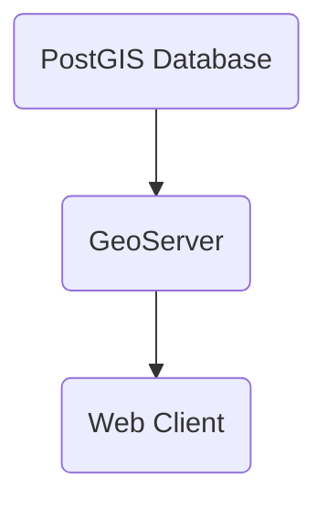

Software Requirements Document
Spatial Apartheid Dataset
Version 2.0
November 14, 2025

- [1.0 Summary](#10-summary)
- [2.0 Project Overview](#20-project-overview)
	- [2.1 Purpose](#21-purpose)
	- [2.2 Scope](#22-scope)
	- [2.3 Stakeholders](#23-stakeholders)
- [3.0 Development Strategy](#30-development-strategy)
	- [3.1 Phased Infrastructure Approach](#31-phased-infrastructure-approach)
	- [3.2 GitHub Development](#32-github-development)
- [4.0 Functional Requirements](#40-functional-requirements)
	- [4.1 Data Management](#41-data-management)
	- [4.2 Query and Analysis](#42-query-and-analysis)
	- [4.3 Visualization](#43-visualization)
- [5.0 Technical Requirements](#50-technical-requirements)
	- [5.1 Local Hardware Requirements](#51-local-hardware-requirements)
	- [5.2 Software Stack](52-software-stack)
	- [5.3 Google Cloud Platform](#53-google-cloud-platform)
	- [5.4 Migration Strategy](#54-migration-strategy)
	- [5.5 Cloud Cost Estimates](#55-cloud-cost-estimates)
- [6.0 Data Requirements](#60-data-requirements)
	- [6.1 Data Types](#61-data-types)
	- [6.2 Data Quality Standards](#62-data-quality-standards)
- [7.0 Systems Requirements](70-systems-requirements)
	- [7.1 Performance Requirements](#71-performance-requirements)
	- [7.2 Security Requirements](#72-security-requirements)
	- [7.3 Availability Requirements](#73-availability-requirements)
- [8.0 User Requirements](#80-user-requirements)
	- [8.1 User Roles](#81-user-roles)
	- [8.2 Accessibility Requirements](#82-accessibility-requirements)
- [9.0 Implementation Plan](#90-implementation-plan)
	- [9.1 Local Development Phases](#91-local-development-phase-months-1-9)
	- [9.2 Cloud Migration Phase](#92-cloud-migration-phase-months-10-11)
- 10.0 Success Criteria
	- 10.1 Quantitative Metrics
	- 10.2 Qualitative Metrics
- 11.0 Risk Management
	- 11.1 Technical Risks
	- 11.2 Operational Risks
- 12.0 Conclusion
- Appendix A: Glossary


# 1.0 Summary
The Spatial Apartheid Dataset project aims to create a publicly accessible, comprehensive dataset and analytical toolkit for the spatial study of apartheid and settler colonial structures. This initiative follows a pragmatic development approach, beginning with local development on consumer hardware and progressing to a cloud-based production deployment on Google Cloud Platform.

The project will be developed using modern software development practices, with GitHub serving as the central platform for version control, collaboration, and project management. This phased approach allows for cost-effective initial development while ensuring scalability for public deployment. The dataset will be built on PostgreSQL with PostGIS extensions, providing robust spatial data management capabilities that can seamlessly migrate from local to cloud environments.

# 2.0 Project Overview

## 2.1 Purpose
The primary purpose of this project is to create a uniform, stable, and academically rigorous resource that enables:
- Quantitative and qualitative spatial analysis of apartheid structures
- Documentation and preservation of historical patterns of land dispossession
- Support for academic research on settler colonialism
- Public education on spatial dimensions of systematic segregation
- Novel research opportunities in the field of spatial justice

## 2.2 Scope
The project encompasses the following components:
- Database infrastructure for spatial and historical data
- Data collection and digitization workflows
- GIS integration and spatial analysis tools
- Web-based visualization and query interfaces
- API for programmatic data access
- Documentation and educational resources

## 2.3 Stakeholders
Primary stakeholders include:
- Indigenous and native communities
- Academic researchers in history, geography, and social sciences
- Educational institutions and students
- Community organizations and advocacy groups
- Policy makers and government agencies
- General public interested in historical spatial justice

# 3.0 Development Strategy

## 3.1 Phased Infrastructure Approach

### Phase 1: Local Development Environment
- Consumer-grade personal hardware setup at home
- PostgreSQL + PostGIS on local machine
- Development and testing with sample datasets
- Cost-effective proof of concept

### Phase 2: Cloud Migration
- Google Cloud SQL for PostgreSQL
- Google Cloud Storage for data archives
- Google App Engine for web application
- Public accessibility and scalability

## 3.2 GitHub Development

### Repository Structure:

``` plain
spatial-apartheid-dataset/
├── database/ # PostgreSQL schemas and migrations
├── data/ # Sample datasets and imports
├── api/ # RESTful API implementation
├── web/ # Web interface
├── scripts/ # Utility and migration scripts
├── docs/ # Documentation
├── tests/ # Test suites
└── .github/ # GitHub Actions workflows 
```

### Development Practices:
- Feature branch workflow with pull requests
- Continuous Integration with GitHub Actions
- Issue tracking and project boards
- Semantic versioning
- Comprehensive documentation in markdown

# 4.0 Functional Requirements

## 4.1 Data Management
    REQ-1. The system SHALL store spatial data including polygons, points, and lines representing historical boundaries, locations, and infrastructure
    REQ-2. The system SHALL maintain temporal data to track changes over time periods
    REQ-3. The system SHALL support multiple data formats including shapefiles, GeoJSON, KML, and CSV
    REQ-4. The system SHALL implement version control for dataset modifications
    REQ-5. The system SHALL provide data validation to ensure spatial and attribute accuracy
## 4.2 Query and Analysis
    REQ-6. The system SHALL support spatial queries using SQL and PostGIS functions
    REQ-7. The system SHALL enable temporal queries to analyze changes over specific time periods
    REQ-8. The system SHALL provide statistical analysis tools for spatial patterns
    REQ-9. The system SHALL support overlay analysis for multiple data layers
    REQ-10. The system SHALL calculate spatial metrics including area, distance, and density
## 4.3 Visualization
    REQ-11. The system SHALL provide interactive web maps for data exploration
    REQ-12. The system SHALL support thematic mapping with customizable symbology
    REQ-13. The system SHALL enable time-series animations showing temporal changes
    REQ-14. The system SHALL generate charts and graphs for statistical visualization
    REQ-15. The system SHALL support export of maps and visualizations in multiple formats

# 5.0 Technical Requirements

## 5.1 Local Hardware Requirements

### Minimum Specifications:
- Processor: Intel i5 or AMD Ryzen 5 (4+ cores)
- RAM: 16GB minimum, 32GB recommended
- Storage: 500GB SSD with 200GB available
- Network: Broadband internet for GitHub sync

## 5.2 Software Stack
- PostgreSQL 14.0+, core database
- PostGIS 3.0+, spatial extensions for PostgreSQL
- Git 2.40+, version control
- Docker, containerization
- Python 3.9+, API/scripting
- QGIS 3.34+, GIS development
- VS Code, IDE

## 5.3 Google Cloud Platform

### Target GCP Architecture
- Cloud SQL for PostgreSQL, managed database with PostGIS
- Cloud Storage - Data archives and backups
- APP Engine - Web application hosting
- Cloud Functions - Serverless API endpoints
- Cloud CDN - Content delivery for maps
- BigQuery - Analytics and reporting

## 5.4 Migration Strategy

### Step 1: Database Export
```bash
pg_dump -h localhost -U postgres -d spatial_apartheid \
--format=custom --no-owner --no-acl > database.dump
```

### Step 2: Cloud SQL Setup
```bash
gcloud sql instances create spatial-apartheid \
--database-version=POSTGRES_14 \
--tier=db-n1-standard-2 \
--region=us-central1 \
--database-flags=cloudsql.enable_postgis=on
```

### Step 3: Data Import
```bash
gcloud sql import sql spatial-apartheid \
gs://spatial-apartheid-bucket/database.dump \
--database=spatial_apartheid
```

## 5.5 Cloud Cost Estimates

| Service            | Configuration     | Estimated Monthly Cost |
| ------------------ | ----------------- | ---------------------- |
| Cloud SQL          | 2 vCPU, 7.5GB RAM | $100-150               |
| Cloud Storage      | 500GB Standard    | $10-15                 |
| App Engine         | F2 instance       | $50-75                 |
| **Total Estimate** |                   | **$160-240**           |

# 6.0 Data Requirements

## 6.1 Data Types

|     | Data Category             | Type          | Format             |
| --- | ------------------------- | ------------- | ------------------ |
|     | Administrative Boundaries | Polygon       | Shapefile, GeoJSON |
|     | Historical Maps           | Raster        | GeoTIFF, JPG       |
|     | Land Ownership Records    | Tabular       | CSV, JSON          |
|     | Demographic Data          | Point/Polygon | CSV, Shapefile     |
|     | Infrastructure            | Line/Point    | KML, GeoJSON       |
|     |                           |               |                    |

## 6.2 Data Quality Standards
- Spatial accuracy: ±5 meters for contemporary data
- Temporal accuracy: Date precision to year minimum, day preferred
- Attribute completeness: >95% for core fields
- Metadata compliance: ISO 19115/19139 standards
- Coordinate system: WGS84 (EPSG:4326) for global data

# 7.0 System Requirements

## 7.1 Performance Requirements
- Query response time: <2 seconds for simple queries
- Map rendering: <5 seconds for standard layers
- Concurrent users: Support for 100+ simultaneous users
- Data upload: Process 1GB files within 10 minutes
- API throughput: 1000 requests per minute

## 7.2 Security Requirements
- SSL/TLS encryption for all data transmission
- Role-based access control (RBAC)
- Audit logging for all data modifications
- Regular security vulnerability assessments
- GDPR compliance for personal data handling

## 7.3 Availability Requirements
- System uptime: 99.5% availability
- Scheduled maintenance window: Monthly, <4 hours
- Disaster recovery: RPO of 24 hours, RTO of 4 hours
- Automated failover for critical components

# 8.0 User Requirements

## 8.1 User Roles
Public User:
- View and explore public datasets
- Download data in standard formats
- Create basic visualizations

Registered Researcher:
- Access to full dataset including restricted content
- Upload and contribute data
- Advanced analysis tools
- Save and share custom queries

Administrator:
- Full system administration rights
- User management and permissions
- Data validation and quality control
- System monitoring and maintenance

## 8.2 Accessibility Requirements
- WCAG 2.1 AA compliance for web interfaces
- Screen reader compatibility
- Keyboard navigation support
- Alternative text for all visual elements
- Multi-language support (initially English)
	- French
	- Spanish
	- Russian
	- Mandarin
	- Japanese
	- Portuguese
	- Dutch
	- Hindi
	- Urdu

# 9.0 Implementation Plan

## 9.1 Local Development Phase (Months 1-9)

### Months 1-2: Foundation
- Set up local development environment
- Initialize GitHub repository
- Design database schema 
- Create Docker containers

### Months 3-5: Core Development
- Implement data import pipelines
- Build RESTful API
- Create basic web interface
- Integrate with QGIS

### Months 6-8: Features & Testing
- Advanced query capabilities
- Visualization tools
- Unit and integration testing
- Documentation

### Month 9: Pre-Migration Preparation
- Performance optimization
- Security audit
- Migration scripts
- GCP account setup

## 9.2 Cloud Migration Phase (Months 10-11)

### Month 10: Infrastructure Setup
- Configure GCP services
- Database migration
- Application deployment
- Testing in cloud environment

### Month 11: Production Readiness
- Performance testing
- Security configuration
- Monitoring setup
- Backup procedures

## 9.3 Launch Phase (Month 12)
- Beta testing with selected users
- Final bug fixes
- Public launch
- Outreach and training

# 10.0 Success Criteria

## 10.1 Quantitative Metrics
- Dataset coverage: >75% of target geographic area
- User adoption: 500+ registered users within first year
- Data downloads: 1000+ downloads per month
- Research citations: 10+ academic papers citing dataset
- System reliability: <1% unplanned downtime

## 10.2 Qualitative Metrics
- Positive user feedback and testimonials
- Recognition from academic community
- Partnership establishment with institutions
- Media coverage and public awareness
- Contribution to policy discussions
# 11.0 Risk Management

## 11.1 Technical Risks
- Data loss or corruption - Mitigated by automated backups
- Performance degradation - Addressed through scalable architecture
- Security breaches - Prevented by comprehensive security measures
- Technology obsolescence - Managed through regular updates

## 11.2 Operational Risks
- Funding shortfalls - Diversify funding sources
- Staff turnover - Document processes and cross-train team
- Legal challenges - Ensure proper licensing and permissions
- Low user adoption - Implement outreach and training programs

# 12.0 Conclusion
The Spatial Apartheid Dataset represents a critical contribution to the study of systematic segregation and native land dispossession through spatial analysis. This requirements document provides a comprehensive framework for developing a robust, scalable, and accessible platform that will serve researchers, educators, policymakers, and the public in understanding historical and contemporary patterns of spatial injustice.

By starting with local development on consumer hardware, utilizing GitHub for version control and collaboration, and planning for eventual migration to Google Cloud Platform, the project can be developed cost-effectively while ensuring professional-grade infrastructure for public deployment.

The use of PostgreSQL with PostGIS throughout both phases ensures consistency and simplifies the migration process. GitHub provides not just version control but also project management, CI/CD pipelines, and collaboration tools essential for modern software development. Google Cloud Platform offers the scalability, reliability, and managed services necessary for a public-facing research platform.

By adhering to these requirements and following the phased implementation plan, the project will deliver a valuable resource that combines academic rigor with public accessibility, supporting evidence-based research and informed dialogue on issues of fundamental importance to social justice and human rights. This approach balances technical excellence with practical constraints, enabling the creation of a valuable resource for studying spatial dimensions of apartheid and settler colonialism while maintaining flexibility for future growth and enhancement.

# Appendix A: Glossary
API - Application Programming Interface
GIS - Geographic Information System
PostGIS - Spatial database extension for PostgreSQL
RBAC - Role-Based Access Control
RESTful - Representational State Transfer architecture
RPO - Recovery Point Objective
RTO - Recovery Time Objective
WCAG - Web Content Accessibility Guidelines
WGS84 - World Geodetic System 1984

# Appendix B: GitHub Integration
## Initial Configuration:
```bash
# Initialize repository
git init spatial-apartheid-dataset
cd spatial-apartheid-dataset

# Create .gitignore
echo '*.pyc' >> .gitignore
echo '.env' >> .gitignore
echo 'node_modules/' >> .gitignore
echo 'data/raw/' >> .gitignore
```
## GitHub Actions CI/CD

Automated Testing Workflow (.github/workflows/test.yml):
```
name: Test Suite
on: [push, pull_request]
jobs:
	test:
		runs-on: ubuntu-latest
		services:
			postgres:
				image: postgis/postgis:14-3.2
```

## Collaboration Guidelines
Branch Strategy:
- **main** - Production-ready code
- **develop** - Integration branch
- **feature/*** - New features
- **bugfix/*** - Bug fixes
- **release/*** - Release preparation

Pull Request Template:
- Description of changes
- Related issue numbers
- Testing performed
- Migration notes 
- Documentation updates

# Appendix C Technical Architecture
This supports the development of a cohesive data schemas for the Apartheid Spatial Dataset.
## Database Design
### Core Tables:
```
	-- Spatial features table
	CREATE TABLE spatial_features (
		id SERIAL PRIMARY KEY,
		feature_type VARCHAR(50),
		geometry GEOMETRY(GEOMETRY, 4326),
		date_start DATE,
		date_end DATE,
		metadata JSONB
	);
```

### API Design
RESTful Endpoints:
- GET /api/v1/features - List features
- GET /api/v1/features/{id} - Get feature details  
- POST /api/v1/query - Spatial query
- GET /api/v1/export - Export data
- POST /api/v1/upload - Upload data (auth required)

# Appendix D Future GeoServer Plan


## Specific Considerations for Spatial Apartheid Dataset
Why PostgreSQL/PostGIS is ESSENTIAL (Not Optional)
